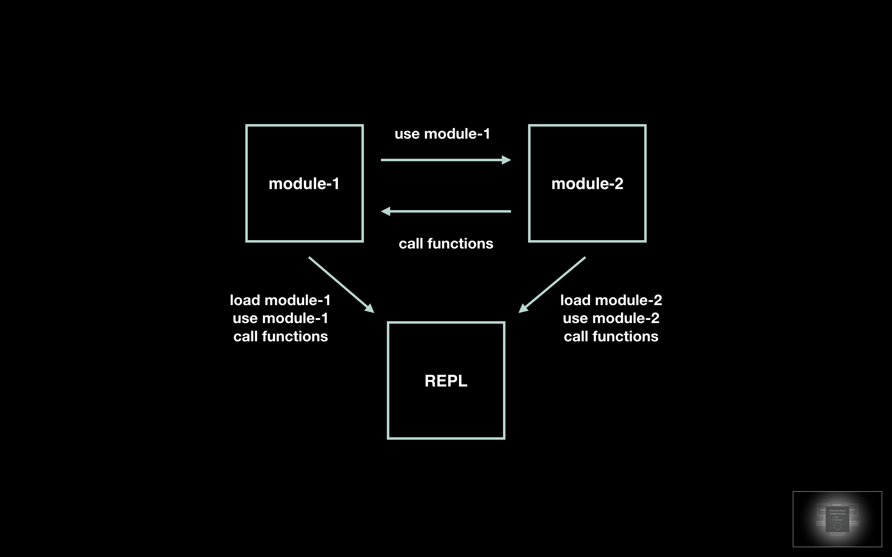
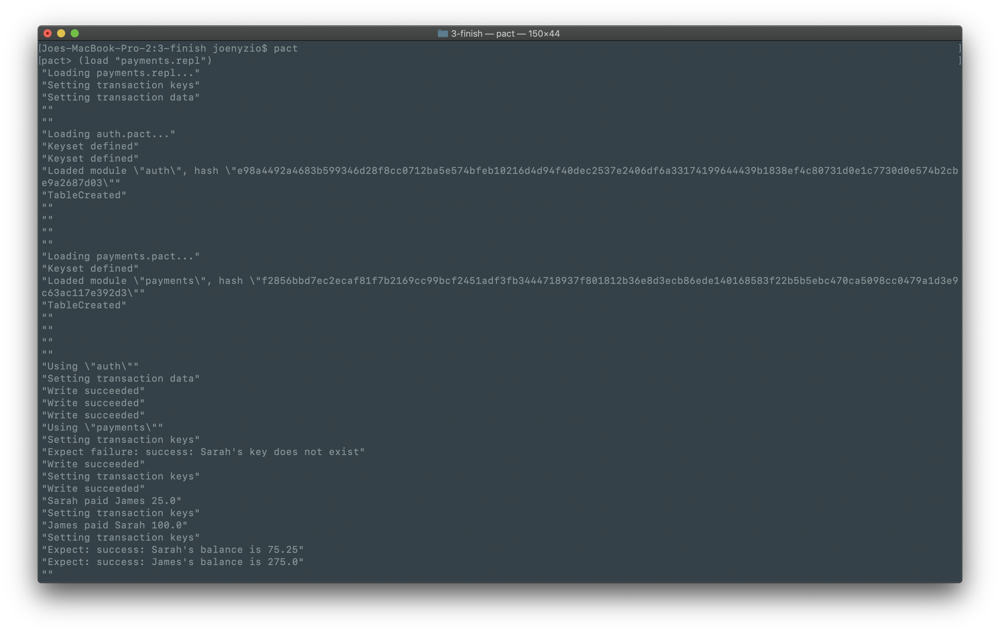

import PageRef from '@components/PageRef'
import Tabs from '@theme/Tabs';
import TabItem from '@theme/TabItem';

# Pact Contract Interaction

Welcome to this tutorial on Pact Contract Interaction!

**Topics covered in this tutorial**

- Pact Contract Interaction Overview
- Project Overview
- Project Environment Setup
- Auth Pact File
- Payments Pact File
- Payments REPL File
- Run the Smart Contract
- Review

The goal of this tutorial is to learn the basics of building interactions between modules in Pact. You will go over some of the fundamentals, then build a smart contract that allows users to both make and authorize payments using multiple Pact modules.

:::note Key Takeaway

Modules can make use of functions within other modules. This is done first with <a href="https://pact-language.readthedocs.io/en/latest/pact-reference.html#use" target="_blank">use</a>, and then by calling the functions from within the module you are using. Each of these files are then loaded into the REPL where you can specify function calls and test interactions between these modules.

:::

<!--truncate-->

## Pact Contract Interaction Tutorial

<iframe width="720" height="405" src="https://www.youtube.com/embed/wCFq5KakaYc" frameborder="0" allow="accelerometer; autoplay; encrypted-media; gyroscope; picture-in-picture" allowfullscreen></iframe>

Subscribe to our <a href="https://www.youtube.com/channel/UCB6-MaxD2hlcGLL70ukHotA" target="_blank">YouTube channel </a> to access the latest Pact tutorials.

## Pact Contract Interaction Overview

Contract interaction allows you to set up more complex smart contracts by working with modules across multiple files. Having access to separate files allows you to break up your smart contracts into more manageable sizes. It also allows you to use helpful files that others have created.

In the image below, you can see that there are 2 files, **module-1** and **module-2**. In this case, **module-2** is using **module-1** to call functions that exist within the module. The REPL file then loads and uses both of these modules to call functions and facilitate the interaction.



The three most helpful Pact functions to keep in mind for Contract Interaction are **load**, **use**, and **function calls**.

**Load**

Load and evaluate a file.

```terminal
(load "file.repl")
```

**Use**

Import an existing module into a namespace.

```terminal
(use MODULE)
```

Once the interaction is set up between files, all function calls can be done the same as if the function existed within that file.

## Project Overview

The idea of working with multiple modules and files is easiest to demonstrate with an example. For that reason, the rest of this tutorial is focused on getting you up and running with your own project.

Before getting started with this application, take a look at the visual overview. This provides a summary of each of the features you will be creating for the Pact Contract Interaction project.


The goal of this project is to write a function in **auth.pact** to use within **payments.pact**. **Payments.pact** will then use **auth.pact** to call specific functions. You will then load modules from both of these files into the **payments.repl** file to run the interaction between these contracts.

**Project Files**

Each number in the image corresponds to one of the files you will work with.

|                   |                                                               |
| ----------------- | ------------------------------------------------------------- |
| **auth.pact**     | Responsible for authorizing users.                            |
| **payments.pact** | Responsible for handling payments between users.              |
| **Payments.repl** | Loads and runs modules from both auth.pact and payments.pact. |

:::info

Both auth.pact and payments.pact are smart contracts that you have worked with in previous tutorials. If you would like to learn more about these smart contracts, feel free to view each of their tutorials.

      * **Auth Module:** <a href="https://pactlang.org/beginner/project-rotatable-wallet/" target="_blank">Project: Rotatable Wallet</a>
      * **Payments Module:** <a href="https://pactlang.org/beginner/pact-accounts-and-transfers/" target="_blank">Accounts and Transfers</a>

:::

There’s not much code to write for this project. Most of it has been written previously in the tutorials linked above. For this tutorial, focus on understanding the interactions between the smart contracts, and to take some time to study how the functions are interacting with each other.

Making the conceptual leap toward understanding the interactions between modules is going to be extremely valuable as you make more complicated smart contracts.

## Project Environment Setup

To get started, choose a project directory and clone the project resources into your local environment.

```terminal
git clone https://github.com/kadena-io/pact-lang.org-code.git
```

Change into the **interaction** directory to begin working on this project.

```terminal
cd pact-lang.org-code/interaction
```

Open this directory in atom to see each of the files provided.

```terminal
atom .
```

As you’ll see, there are a few separate folders available to you.

|                |                                                                                                                                                                             |
| -------------- | --------------------------------------------------------------------------------------------------------------------------------------------------------------------------- |
| **start**      | Provides a starting point with all comments for every challenge.                                                                                                            |
| **challenges** | Challenges in the demo are broken out into separate files, allowing you to build your application over time while having the flexibility to experiment with your own ideas. |
| **finish**     | Includes all comments and code for the final application.                                                                                                                   |
| **loans**      | Includes final application without the challenge comments.                                                                                                                  |

Each of these options are meant to help support you as you work through these challenges. Feel free to use them however you’d like.

## 1. Auth Pact File

The first step of this project is to write the function that you will call from the **payments** smart contract. You will write this function within the **auth** smart contract.

:::info

Navigate to **1-start/auth.pact** or to **2-challenges/1-auth-pact** depending on how you prefer to follow along.

:::

### 1.1 Enforce User Auth

The function you will write will enforce user authentication for payments made with accounts. This will be a valuable function for restricting access to either admins or account users, ensuring each user is the only person that has control over their account.

:::caution Code Challenge

Define a function enforce-user-auth that you can use to verify user authorization.

>* <a href="https://github.com/kadena-io/pact-lang.org-code/blob/master/interaction/2-challenges/1-auth-pact/1.1-enforce-user-auth/challenge.pact" target="_blank">Challenge</a>
>* <a href="https://github.com/kadena-io/pact-lang.org-code/blob/master/interaction/2-challenges/1-auth-pact/1.1-enforce-user-auth/solution.pact" target="_blank">Solution</a>

:::

:::info

A function similar to this is covered in Challenge <a href="https://pactlang.org/beginner/project-rotatable-wallet/#42-enforce-user" target="_blank">4.2 in Project Rotatable Wallet</a>. You can look back to this challenge for more information to help get you started.

:::

## 2. Payments Pact File

Next, you will work on the **payments.pact** file.

The goal is to use the **auth** module, then call the function you wrote within the **payments** module to specify authorization for users.

:::info

Navigate to **1-start/payments.pact or to 2-challenges/2-payments-pact** depending on how you prefer to follow along.

:::

### 2.1 Use Auth

The first step is to get access to the **auth** module. You can do this with the Pact special form <a href="https://pact-language.readthedocs.io/en/latest/pact-reference.html#use" target="_blank">use</a>.

The syntax for **use** looks like this.

```terminal
(use MODULE)
```

It’s simple but extremely powerful! This is what will allow you to call functions from the **auth** module.

:::caution Code Challenge

Take a moment now to **use** the **auth** module from within the **payments** module.

>* <a href="https://github.com/kadena-io/pact-lang.org-code/blob/master/interaction/2-challenges/2-payments-pact/2.1-use-auth/challenge.pact" target="_blank">Challenge</a>
>* <a href="https://github.com/kadena-io/pact-lang.org-code/blob/master/interaction/2-challenges/2-payments-pact/2.1-use-auth/solution.pact" target="_blank">Solution</a>

:::

### 2.2 Create Account

For this application, it’s important that only the administrator has access to create an account. This is a good use case for the **enforce-user-auth** function you wrote in the **auth** module.

Since you now have access to the auth module, you can begin working with its functions. You can call these functions the same as you would call any other function.

```clojure
(function-name parameter)
```

Take some time now to add this new functionality to your smart contract.

:::caution Code Challenge

Call **enforce-user-auth** from within the **create-account** function to authorize that the user is an administrator.

>* <a href="https://github.com/kadena-io/pact-lang.org-code/blob/master/interaction/2-challenges/2-payments-pact/2.2-create-account/challenge.pact" target="_blank">Challenge</a>
>* <a href="https://github.com/kadena-io/pact-lang.org-code/blob/master/interaction/2-challenges/2-payments-pact/2.2-create-account/solution.pact" target="_blank">Solution</a>

:::

### 2.3 Get Balance

Another time you may want to authorize a user is when checking the balance of an account.

The **payment** modules **get-balance** function is an excellent use case for this. This time, both the administrator and the owner of the account should have access to view the account balance.

Similar to before, check for authorization within the **get-balance** function.

:::caution Code Challenge

Call **enforce-user-auth** from within the **get-balance** function to authorize that function is called by the administrator.

>* <a href="https://github.com/kadena-io/pact-lang.org-code/blob/master/interaction/2-challenges/2-payments-pact/2.3-get-balance/challenge.pact" target="_blank">Challenge</a>
>* <a href="https://github.com/kadena-io/pact-lang.org-code/blob/master/interaction/2-challenges/2-payments-pact/2.3-get-balance/solution.pact" target="_blank">Solution</a>

:::

### 2.4 Pay

Finally, it’s important that payments are authorized by the owner of the account. This will ensure that only the person who has the money is able to send it to others.

:::caution Code Challenge

Finish off the **payment** module by authorizing that the payment is being sent by the owner of the account.

>* <a href="https://github.com/kadena-io/pact-lang.org-code/blob/master/interaction/2-challenges/2-payments-pact/2.4-pay/challenge.pact" target="_blank">Challenge</a>
>* <a href="https://github.com/kadena-io/pact-lang.org-code/blob/master/interaction/2-challenges/2-payments-pact/2.4-pay/solution.pact" target="_blank">Solution</a>

:::

That completes the payment module.

You are now ready to set up this contract interaction using the **payments.repl** file!

## 3. Payments REPL File

You can now finish this project by completing on the **payments.repl** file.

:::info

Navigate to **1-start/payments.repl** or to **2-challenges/3-payments-repl** depending on how you prefer to follow along.

:::

The goal is to use both the **auth** and **payments** module, then coordinate interactions between them.

### 3.1 Load Auth Module

To get started, you need access to the **auth** module from within the **payments.repl** file.

This is done using <a href="https://pact-language.readthedocs.io/en/latest/pact-functions.html?highlight=load#load" target="_blank">load</a>.

```clojure
(load "file.pact")
```

Try using **load** to complete the code challenge.

:::caution Code Challenge

Load the **auth** module into the **payments.repl** file.

>* <a href="https://github.com/kadena-io/pact-lang.org-code/blob/master/interaction/2-challenges/3-payments-repl/3.1-load-auth-module/challenge.repl" target="_blank">Challenge</a>
>* <a href="https://github.com/kadena-io/pact-lang.org-code/blob/master/interaction/2-challenges/3-payments-repl/3.1-load-auth-module/solution.repl" target="_blank">Solution</a>

:::

:::info

Transactions and loading are covered in more detail in <a href="https://pactlang.org/beginner/testing-pact-code-in-the-sdk/" target="_blank">Testing Pact Code in the SDK</a>.

:::

### 3.2 Load Payments Module

Next, you need to load the **payments** module into the **payments.repl** file.

This can be done the same way as you did with the **auth** module.

:::caution Code Challenge

Load the **payments** module into the **payments.repl** file.

>* <a href="https://github.com/kadena-io/pact-lang.org-code/blob/master/interaction/2-challenges/3-payments-repl/3.2-load-payments-module/challenge.repl" target="_blank">Challenge</a>
>* <a href="https://github.com/kadena-io/pact-lang.org-code/blob/master/interaction/2-challenges/3-payments-repl/3.2-load-payments-module/solution.repl" target="_blank">Solution</a>

:::

### 3.3 Use Auth Module

You now have access to both the auth and payments module from within the **payments.repl** file. After loading each file, you also need to specify that you are using them.

Like before, this can be done with the special form **use**.

```clojure
(use MODULE)
```

:::caution Code Challenge

Use the **auth** module from within the **payments.repl** file.

>* <a href="https://github.com/kadena-io/pact-lang.org-code/blob/master/interaction/2-challenges/3-payments-repl/3.3-use-auth-module/challenge.repl" target="_blank">Challenge</a>
>* <a href="https://github.com/kadena-io/pact-lang.org-code/blob/master/interaction/2-challenges/3-payments-repl/3.3-use-auth-module/solution.repl" target="_blank">Solution</a>

:::

### 3.4 Use Payments Module

Finally, you need to use the payments module. Write one final line of code that uses the payments module and completes your set up for contract interaction.

:::caution "Code Challenge"

Use the **payments** module from within the **payments.repl** file.

>* <a href="https://github.com/kadena-io/pact-lang.org-code/blob/master/interaction/2-challenges/3-payments-repl/3.4-use-payments-module/challenge.repl" target="_blank">Challenge</a>
>* <a href="https://github.com/kadena-io/pact-lang.org-code/blob/master/interaction/2-challenges/3-payments-repl/3.4-use-payments-module/solution.repl" target="_blank">Solution</a>

:::

You are now finished setting up your contract interaction. Congratulations!

---

## 4. Run REPL File

After completing your contract interaction project, you can now see it all work together.

To do this, navigate back to your terminal.

From the terminal, you can navigate into **1-start** folder if you have worked within this directory. If not, you can also navigate to the **3-finish** folder for an example of the completed application.

```terminal
cd 3-finish
```

Open Pact.

```terminal
pact
```

Load the **payments.repl** file.

```terminal
(load "payments.repl")
```

The output to your terminal should look similar to the image shown below.



:::info

For more information on running files from the terminal, view <a href="https://pactlang.org/beginner/testing-pact-code-in-the-sdk/#run-repl-file" target="_blank">Testing Pact Code in the SDK</a>.

:::

## Review

Congratulations on completing this introduction to Pact Contract Interaction!

In this tutorial, you learned the basics of contract interaction and built a smart contract that allowed users to both make and authorize payments. This allowed you to extend the functionality of your smart contract to include multiple files, and you can now use this to build more complex smart contracts in any project.

Take a look back at some of the modules you have written or examples that you’ve come across. Are there any interesting new ways that you think these contracts could work together? Give it a try and see if you can come up with an entirely new smart contract that combines these interesting features in new ways!
